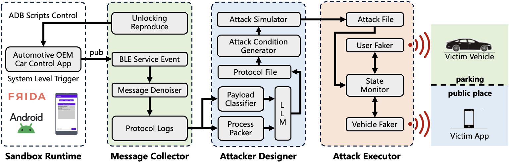

# What is BKEAttacker

Passive keyless entry and start (PKES) system, which enables automatic vehicle unlocking and ignition based on the proximity of an authenticated key fob or smartphone, has been shown to be susceptible to various relay and spoofing attacks. However, existing methods are limited by short attack ranges, poor adaptability across brands, and inefficiencies due to protocol obfuscation and encryption.

This paper introduces BKEAttacker , a novel, automated, and generalized attack framework designed to systematically evaluate the security of Bluetooth-based PKES (B-PKES) systems across multiple smart vehicle brands. Unlike prior approaches that require labor-intensive reverse engineering and are often limited to specific models or versions, BKEAttacker leverages a sandbox-based runtime environment to reconstruct the underlying B-PKES protocol logic by mapping Android application-layer BLE interfaces to low-level system functions—regardless of code fragmentation, obfuscation, or encryption. Based on this reconstructed protocol, BKEAttacker identifies implemented defense mechanisms and generates a structured Attack Profile , which is then used by the Attack Executor to perform fully automated Man-in-the-Middle (MitM) attacks.

Extensive evaluations demonstrate the effectiveness of BKEAttacker across 6 major smart vehicle brands and over 20 distinct models currently on sale. In every tested case where the vehicle was equipped with B-PKES functionality, BKEAttacker successfully executed unauthorized remote unlocking, and in some configurations, even enabled remote vehicle ignition.

Passive keyless entry and start (PKES) systems have become a common target of relay and spoofing attacks. Existing methods, however, suffer from limited range, poor adaptability across brands, and inefficiency due to protocol obfuscation.This paper introduces BKEAttacker , a generalized and automated attack framework for evaluating the security of Bluetooth-based PKES (B-PKES) systems. It reconstructs the underlying protocol logic through a sandbox-based runtime environment, enabling fully automated Man-in-the-Middle (MitM) attacks without prior knowledge of the implementation.
We evaluate BKEAttacker on six major vehicle brands and over 20 models, achieving successful unauthorized unlocking in all cases. In some configurations, remote vehicle ignition was also possible, revealing widespread security weaknesses in commercial B-PKES implementations.

# How does PoltergeistAttack work?

BKEAttacker operates through a structured, four-phase workflow—**Sandbox Runtime**, **Message Collector**, **Attacker Designer**, and **Attack Executor**—enabling systematic and automated security evaluation of Bluetooth-based Passive Keyless Entry and Start (B-PKES) systems.

1. **Sandbox Runtime**:  
   The workflow begins by executing the vehicle’s official Android application within a sandboxed environment. This module dynamically traces BLE interactions between the app and the system by establishing explicit mappings from application-layer functions to system-level operations. By doing so, it eliminates reliance on traditional reverse engineering techniques and enables protocol reconstruction regardless of code obfuscation or fragmentation.

2. **Message Collector**:  
   While the application runs inside the sandbox, this component monitors key execution paths related to vehicle unlocking and captures all relevant BLE events. These raw logs undergo noise reduction processing to extract clean, protocol-relevant message sequences that serve as input for further analysis.

3. **Attacker Designer**:  
   This phase automates attack generation through two sub-components:
   - **Protocol Analyzer**: Utilizes model-driven methods and large language models (LLMs) to transform raw BLE logs into structured representations of the B-PKES protocol.
   - **Attack Simulator**: Simulates various attack scenarios against the reconstructed protocol to evaluate resistance to MitM attacks and identify exploitable vulnerabilities. Based on this analysis, an *Attack Profile* is generated, encoding the steps required to perform the attack.

4. **Attack Executor**:  
   In the final phase, the Attack Executor loads the generated *Attack Profile* and performs a fully automated Man-in-the-Middle (MitM) attack against the target vehicle. It mimics both the user’s device and the vehicle’s responses to execute unauthorized operations such as remote unlocking and, in some cases, ignition.

This end-to-end workflow allows BKEAttacker to generalize across different automotive brands and B-PKES implementations, overcoming limitations of prior approaches and enabling scalable, automated vulnerability discovery and exploitation.

# Real-world Attack Evaluation

To evaluate the effectiveness of BKEAttacker in real-world scenarios, we conducted testing across **6 prominent intelligent automotive brands** and over **20 distinct vehicle models** currently on the market. Here are some [demo videos](www.baidu.com "BKEAttacker Demo Video").